# Actividad 4: API REST con Spring Security y JWT

**Alumno:** Angel de Jesus Mendez Garcia

**Profesora:** Adelina Martinez Nieto

**Materia:** Verano de Programacion WEB

## Descripcion del Proyecto
Esta es la Actividad 4 donde desarrolle una API REST usando Spring Boot conectada a una base de datos MySQL. A diferencia de las actividades pasadas donde usabamos Thymeleaf para las vistas, aqui todo devuelve un formato JSON. Ademas, integre Spring Security para proteger las rutas de mi CRUD de equipos y jugadores usando tokens reales JWT, por lo que nadie puede ver o modificar la informacion sin iniciar sesion primero.

## Estructura del Proyecto y Clases

### Models (Modelos)
Son las clases que representan las tablas en la base de datos de MySQL usando anotaciones de JPA.
*   **Equipo:** Tiene los datos del equipo (id, nombre, ciudad) y su relacion de uno a muchos con los jugadores.
*   **Jugador:** Guarda los datos del jugador y tiene una relacion de muchos a uno para saber a que equipo pertenece usando una llave foranea.
*   **Usuario:** Es la nueva tabla que cree para guardar a los usuarios que se registran en la API, aqui se guarda el nombre, email y el password.

### DTOs (Data Transfer Objects)
Estas clases sirven para controlar que datos entran y salen, asi evito exponer toda la entidad de la base de datos, sobre todo el password del usuario.
*   **EquipoDTO y JugadorDTO:** Los uso para enviar y recibir los datos en JSON. Les puse validaciones con @Valid como @NotBlank y @NotNull para que el usuario no mande informacion vacia.
*   **UsuarioRegistroDTO:** Lo uso para pedir el nombre, email y password cuando alguien nuevo se registra.
*   **LoginDTO:** Solo pide el email y el password para poder iniciar sesion.

### Repositories (Repositorios)
Son interfaces que heredan de JpaRepository para poder hacer consultas a la base de datos de forma facil.
*   **EquipoRepository y JugadorRepository:** Los uso para guardar, borrar, actualizar y buscar equipos y jugadores.
*   **UsuarioRepository:** Tiene un metodo extra llamado findByEmail que cree especificamente para poder buscar si un usuario ya existe en la base de datos usando su correo.

### Services (Servicios)
Aqui va toda la logica de mi programa y es donde hago la traduccion de Modelos a DTOs y viceversa.
*   **IEquipoService y IJugadorService:** Son las interfaces donde declaro los metodos que voy a usar para el CRUD.
*   **EquipoService y JugadorService:** Es donde escribo el codigo real de los metodos. Tambien aqui implemente la paginacion, usando objetos Page y Pageable para no regresar todos los registros de la base de datos de un solo golpe.

### Controllers (Controladores)
Son los que reciben las peticiones HTTP y mandan llamar a los servicios.
*   **EquipoController y JugadorController:** Tienen mapeadas las rutas con los verbos correctos (GET, POST, PUT, DELETE). Usan ResponseEntity para regresar codigos de estado correctos como 200 OK, 201 Created o 404 Not Found.
*   **AuthController:** Tiene dos rutas POST publicas. La de /register encripta la contraseña usando BCrypt antes de guardar al usuario, y la de /login verifica las credenciales y devuelve el token JWT generado.

### Security (Seguridad)
Son las clases que investigue y configure para que funcionara la autenticacion.
*   **SecurityConfig:** Aqui configure Spring Security para apagar el CSRF, dejar publicas las rutas de auth y bloquear todas las demas rutas pidiendo autenticacion.
*   **JwtTokenUtil:** Es un componente con metodos para generar el token a partir del email, sacar datos del token y revisar si no ha expirado.
*   **JwtRequestFilter:** Es un filtro que cree para que intercepte cada peticion que entra, extraiga la cabecera Authorization, valide el token y le diga a Spring Security que el usuario puede pasar.
*   **UserDetailsServiceImpl:** Busca al usuario por correo en la base de datos para que el filtro de seguridad lo pueda validar.

## Pruebas de la API (Coleccion de Bruno)
Toda mi coleccion con las peticiones de prueba esta guardada en la carpeta `/bruno` dentro de este proyecto. A continuacion presento las capturas divididas en dos fases: mi entorno local y el despliegue en mi servidor.

### Fase 1: Pruebas Locales
Estas pruebas las realice corriendo el proyecto desde mi maquina local apuntando a localhost.

#### Pruebas de Usuario y Seguridad
*   **Registro:** Captura de la peticion POST a /api/auth/register guardando un usuario nuevo.
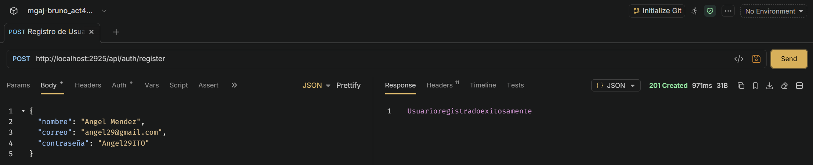

*   **Login:** Captura de la peticion POST a /api/auth/login devolviendo el token JWT al validar el usuario.
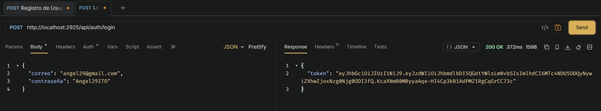

*   **Acceso denegado (Sin Token):** Captura intentando hacer una peticion sin mandar nada en la pestaña Auth, mostrando que el servidor local lo rechaza correctamente y protege la ruta.
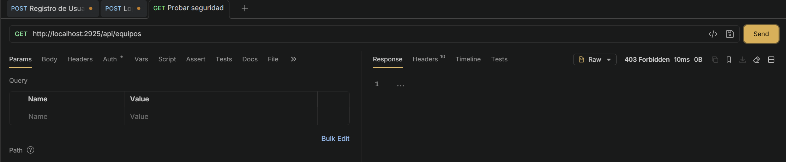

#### Pruebas de Equipo
*   **Listar Equipos (GET):** Captura obteniendo la lista paginada de equipos usando el token.
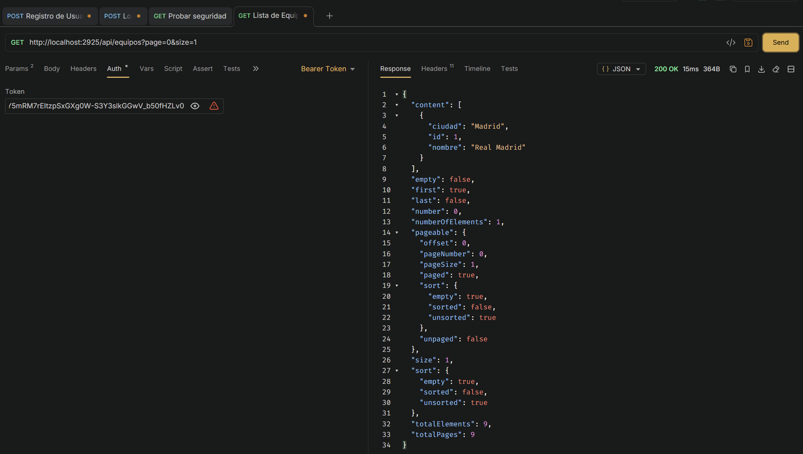

*   **Crear Equipo (POST):** Captura guardando un equipo nuevo usando el Bearer Token.
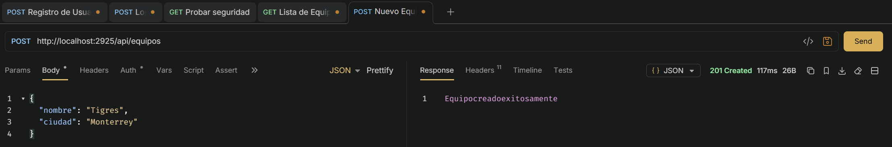

*   **Actualizar Equipo (PUT):** Captura modificando los datos de un equipo existente.
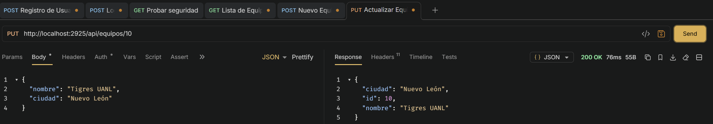

*   **Eliminar Equipo (DELETE):** Captura borrando un equipo y recibiendo el codigo 204 No Content.
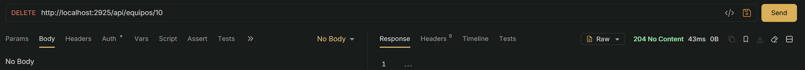

#### Pruebas de Jugadores
*   **Listar Jugadores (GET):** Captura consultando los jugadores con paginacion y autenticacion.
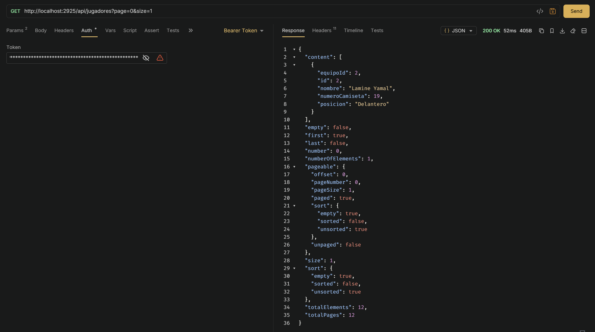

*   **Crear Jugador (POST):** Captura agregando un jugador y asignandolo a un equipo existente usando el token.
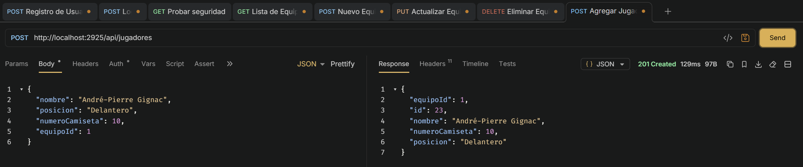

*   **Actualizar Jugador (PUT):** Captura editando la informacion de un jugador.
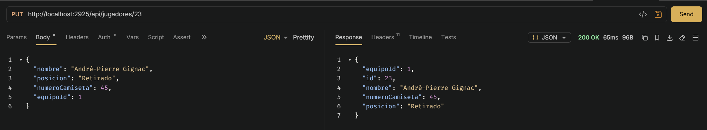

*   **Eliminar Jugador (DELETE):** Captura eliminando un registro de jugador de forma exitosa.
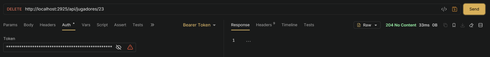

### Fase 2: Pruebas en VPS
Para esta fase genere el archivo .jar de mi proyecto y lo subi a mi VPS para probar que la API funcione correctamente ya desplegada. En Bruno cambie las peticiones para apuntar a la IP de mi servidor.

#### Pruebas de Usuario y Seguridad
*   **Registro y Login:** Capturas comprobando que la creacion de usuario y la generacion del token JWT funcionan en el entorno de produccion.
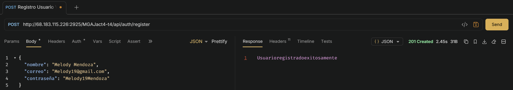

*   **Login:** Captura de la peticion POST a /api/auth/login devolviendo el token JWT al validar el usuario.
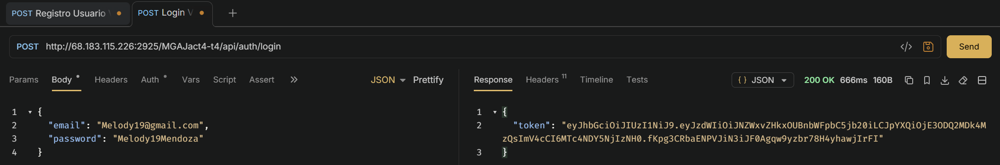

*   **Acceso denegado (Sin Token):** Captura demostrando que el servidor VPS tambien bloquea el acceso exitosamente si no se incluye el token.
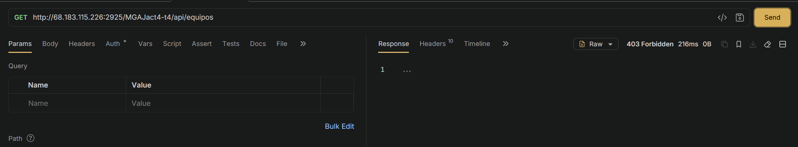

#### Pruebas de Equipo
*   **Listar Equipos (GET):** Captura listando los equipos desde la base de datos de produccion.
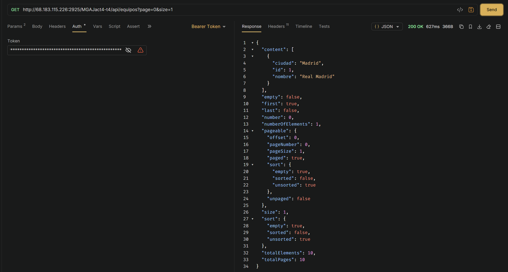

*   **Crear Equipo (POST):** Captura demostrando la creacion de un equipo usando la IP del servidor.
  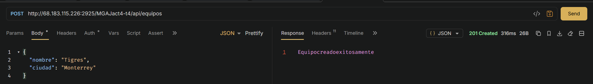

*   **Actualizar Equipo (PUT):** Captura modificando un equipo remotamente.
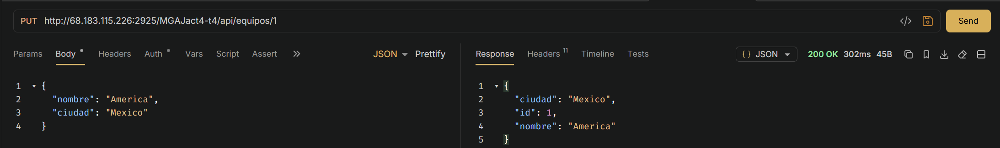

*   **Eliminar Equipo (DELETE):** Captura confirmando que la eliminacion funciona en el servidor.
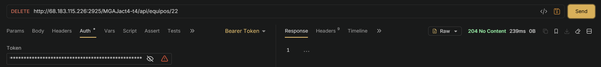

#### Pruebas de Jugadores
*   **Listar Jugadores (GET):** Captura de la lectura de jugadores remotamente.

*   **Crear Jugador (POST):** Captura de la peticion POST exitosa para jugadores en el VPS.
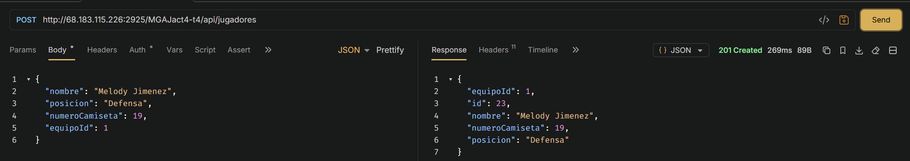

*   **Actualizar Jugador (PUT):** Captura de la actualizacion de datos de un jugador en produccion.
  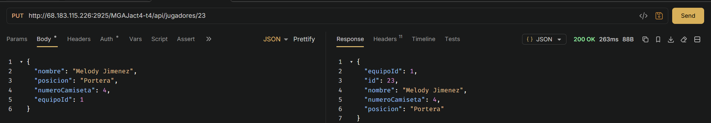

*   **Eliminar Jugador (DELETE):** Captura borrando un jugador en el servidor VPS.
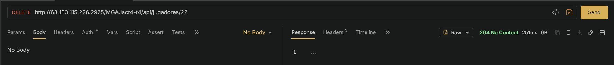

## Enlaces en la VPS
**Endpoints Principales:**
* **Autenticación (Registro):** POST http://68.183.115.226:2925/MGAJact4-t4/api/auth/register
* **Autenticación (Login):** POST http://68.183.115.226:2925/MGAJact4-t4/api/auth/login
* **CRUD Equipos:** http://68.183.115.226:2925/MGAJact4-t4/api/equipos
* **CRUD Jugadores:** http://68.183.115.226:2925/MGAJact4-t4/api/jugadores